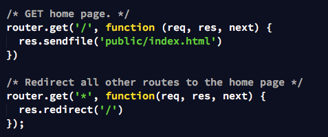

# I Wanna Roomie - My First Angular App

This is my final project for <a href="https://generalassemb.ly/education/web-development-immersive" target="_blank">GA's Web Development Immersive</a>

- Token-based authentication
- Backend

  - Only serves JSON
  - Always redirects you to the home page
    

- Front-end

  - Uses Angular 1.5 Components
  - Uses Angular Component Router (instead of ui-router)
    - ngComponentRouter
  - wapweb.componentRouterActive
    - Custom directive that works with component router. Tells you which route is “active” for the navbar
  - Materialize CSS Framework
    - http://materializecss.com/ - basic materialize
    - ui.materialize - custom materialize directives that initialize materialize forms correctly.
    - Allowed me to use minimal CSS!

Models
- Listings
  - references users that have favorited it.
- Users
  - references all the listings that the user creates.

Listings

Users

How does the Component Router Work?
Everything goes inside of the <app></app> component (instead of in <ui-view></ui-view> with ui-router)

So at the home screen (www.ajbnb.com/#/), this is what’s being rendered in the body:
<app>
     <navbar></navbar>
     <ng-outlet>
<home></home>
     <ng-outlet>
</app>

And at listings (www.ajbnb.com/#/listings), this is what’s being rendered in the body:
<app>
     <navbar></navbar>
     <ng-outlet>
         <listings>
               <ng-outlet>
    
               </ng-outlet>
          </listings>
     <ng-outlet>
</app>

Including components in index.html:

Listing Component and sub components

Reusing listingCard Component
On Listing List Template:

On My Profile Page:

The card component:

Creating/ Editing a listing
Materialize forms require initialization (boo!).

- Real solution: create a custom directive
- Hack: run initializations within $timoueout

Updating the grammar!

Updating the listing model

Liking
Frontend:
ng-click -> likeListing(id)

Check if listing is already liked and send request

Backend: push my _id (from the token) into the listing.favUsers array

Frontend: update the listing object. (note: this listing doesn’t exist within an array of listings because each listing is wrapped within a listingCard component)

Disliking:
Frontend: basically same request as like but to different endpoint

Backend: splice the listing from the array

amILiked()
checks if user’s _id (in the token) is in the listing.favUsers array

amILiked() also used to show correct icon

Next Steps

- User Chat
- An actual map
- Job Posts
