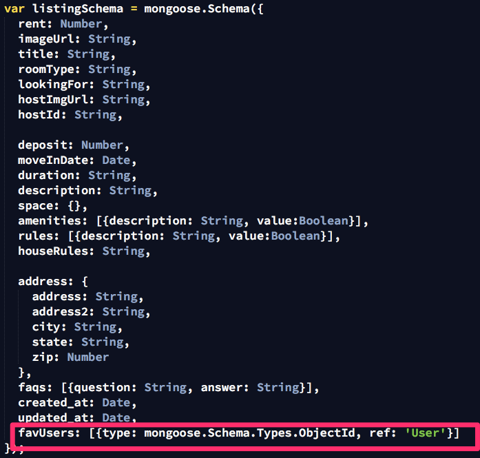

# I Wanna Roomie - My First Angular App

This is my final project for GA's [Web Development Immersive](https://generalassemb.ly/education/web-development-immersive) Program and it is my first full MEAN Stack (mongo, express, angular, node) app. It is a full-fledged single page app with a Restful API in the backend and Angular JS making all the updates on the client side. Since this was a learning experience. I also learned how to use Angular 1 components and it's component router rather than using the ui-router, since I built practice apps using the ui-router in class. Thanks to my instructor Hannah Howard for teaching me the basics of Angular 1 components and component router!

## Overview

This app uses the following technologies


**Token-based authentication**
**Backend**

- Only serves JSON, is a restful api
- Except for the home directory, which serves you the single page app.
  

**Front End**

- Uses Angular 1.5 Components
- Uses Angular Component Router (instead of ui-router)
  - ngComponentRouter
  - wapweb.componentRouterActive
  - Custom directive that works with component router. Tells you which route is “active” for the navbar


- Materialize CSS Framework
  - http://materializecss.com/ - basic materialize
  - ui.materialize - custom materialize directives that initialize materialize forms correctly.
  - Thanks to materialize css framerwork, I only had to create minimal CSS! This is what my css looks like.


**Models**
- Listings
  - This is the main model. It contains all the information of each listing.
  - It also references users that have favorited it.
    

- Users
  - References all the listings that the user creates.


## How does the Component Router Work?

Everything goes inside of the `<app></app>` component (instead of within ` <ui-view></ui-view>` with ui-router)


So in when I created the main app module: 

1. I injected ngComponentRouter (which must be included in the index.html page) 
2. I set the "root route" to the app component with `.value(...)` 
3. And then I defined the app component `.component(...)`. 


Notice the app component has a very simple template: The `<navbar>` component and `<ng-outlet></ng-outlet>` which is where every other part of the app will be rendered.

Every route must have three things: 

- **path**: the relative url path
  - If you are going to have sub routes, use the "…" after a plath, like in **listings** and **users** in the figure above. Warning: all routes must terminate somewhere, you can't use "…" if you're not going to have sub routes
- **name:** 
  - These are shortcuts you can use to to navigate throughout your site rather than having to figure out the actual urls.
- **component**: 
  - The specified component will be rendered in the `<ng-outlet></ng-outlet>` of the **app** component in the example above.
- **useAsDefault:** (optional)
  - This sets the default route for this component.

So at the home screen (www.ajbnb.com/#/), this is what’s being rendered in the body:

```html
<app>
     <navbar></navbar>
     <ng-outlet>
		<home></home>
     <ng-outlet>
</app>`
```

And at listings (www.ajbnb.com/#/listings), this is what’s being rendered in the body:
```html
<app>
     <navbar></navbar>
     <ng-outlet>
         <listings>
               <ng-outlet>
                 	<!-- other components go here, depending on what subroute of listings you're on. -->
                 	<!--  The listings component has its own set of sub routes, defined by $routeConfig  -->
               </ng-outlet>
          </listings>
     <ng-outlet>
</app>
```

And this is what the **listings component** looks like:

Notice it has it's own set of sub routes.


Using components makes it really easy to organize features by components and it greatly reduced the number of files I had to include on the `index.html` page. 

User authentication and signin/signup were not made with components (because I did not write that from scratch—thanks WDI teachers!), so it took 8 lines to include all those files. However, the three main components for this app—home, listings, and users—only need to be included once. Each JS file references their respective files. For example, the `listings.js` looks like this:
 


Reusing listingCard Component
On Listing List Template:

On My Profile Page:

The card component:

Creating/ Editing a listing
Materialize forms require initialization (boo!).

- Real solution: create a custom directive
- Hack: run Materialize initializations within $timoueout

Updating the grammar!

Updating the listing model

Liking
Frontend:
ng-click -> likeListing(id)

Check if listing is already liked and send request

Backend: push my _id (from the token) into the listing.favUsers array

Frontend: update the listing object. (note: this listing doesn’t exist within an array of listings because each listing is wrapped within a listingCard component)

Disliking:
Frontend: basically same request as like but to different endpoint

Backend: splice the listing from the array

amILiked()
checks if user’s _id (in the token) is in the listing.favUsers array

amILiked() also used to show correct icon

Next Steps

- User Chat
- An actual map
- Job Posts
